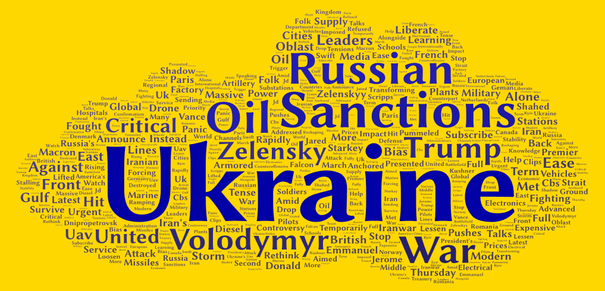
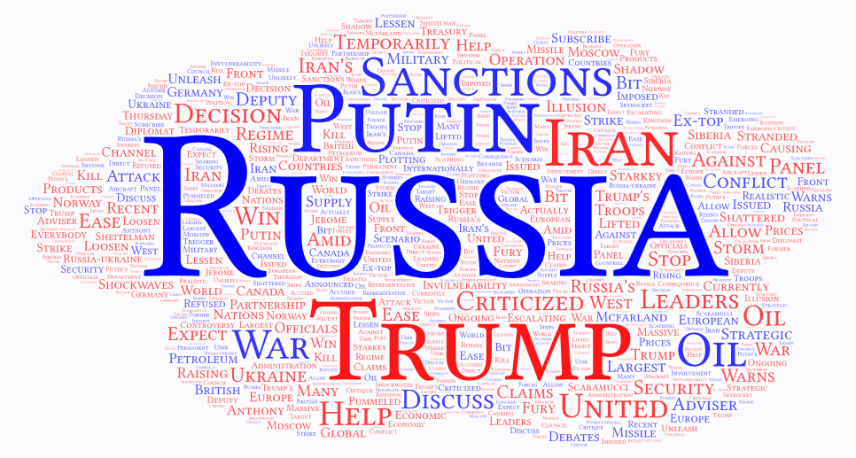

# Lab02-YT-Visualization
GEOG 458 Lab02: Web Data Collection and Visualization

## Ukraine vs Russia: Sanctions
For my topic, I decided to compare the outputs of two locations - Ukraine and Russia. The search parameters I used for this assignment were "Ukraine", "Russia", "Zelensky", "Putin", and "Sanctions".

 Ukraine and Russia have been at war since 2021, but the new war that started in Iran recently has pushed countries like the US to soften their stance on Russia’s oil sanctions that have been in place since the war started. Since both Russia and Ukraine have addressed this change, I wanted to see the differences in the topics and words surrounding the event that will impact both countries. 

 ## Visualizations
 
 Fig 1. Ukraine's visualization using "ukraine", "zelensky", "sanctions"
[Download the Ukraine dataset](assets/Ukraine_Zelensky_Sanctions.csv)

 
Fig 2. Russia's visualization using "russia", "putin", "sanctions"
[Download the Russia dataset](assets/Russia_Putin_Sanctions.csv)

## Comparison
The differences may be due to a number of factors. The first being that this topic directly involves Russia, and indirectly affects Ukraine. Since governments are directly responding to news about Russia and this specific situation created by its oil sanctions, it stands to reason that Ukraine would not be among the top words related to the event. It could also have to do with the fact that, for Russia, the news that sanctions are softening is positive, whereas in Ukraine, it would be seen as negative. This being seen as a negative in Ukraine could cause the region to respond defensively and attempt to remind viewers of Russia’s actions against them, as they stand more to lose from softening sanctions. 

In the future, it would be interesting to focus only on YouTube videos from either Ukraine or Russia. It would be difficult to geographically center the results in these regions because the results may be in Ukrainian or Russian, leading to inaccurate results if not all parameters are available in multiple languages. But this would make the results more accurate in reflecting the opinions of these two warring nations in the situation.

For me, the data surprised me because I was not expecting a difference in the top 10 words. The fact that words like ‘Ukraine’, ‘Trump’ are so different in the maps are sized so differently despite both regions being drastically affected by them was unexpected. 

